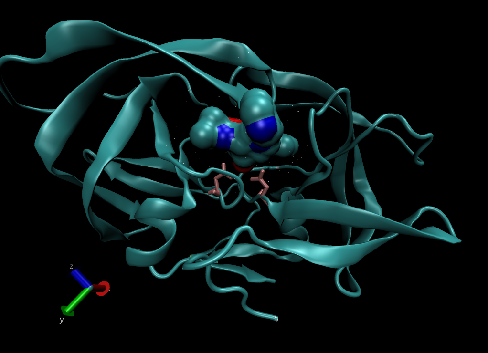

# The PDB Database

```{r}
PDB_data <- read.csv(file = "PDB_data_downloaded.csv", row.names = 1)
PDB_data
```

> Q1: What percentage of structures in the PDB are solved by X-Ray and Electron Microscopy?

```{r}
# X-Ray
sum(PDB_data$X.ray)/sum(PDB_data$Total)

# Electron Microscopy
sum(PDB_data$EM)/sum(PDB_data$Total)

# X-Ray + EM
(sum(PDB_data$X.ray)+sum(PDB_data$EM))/sum(PDB_data$Total)
```

How about for every method?

```{r}
round(colSums(PDB_data) / sum(PDB_data$Total) * 100, 2)
```


> Q2: What proportion of structures in the PDB are protein?

```{r}
PDB_data[1,7] / sum(PDB_data$Total)
```


> Q3: Type HIV in the PDB website search box on the home page and determine how many HIV-1 protease structures are in the current PDB?

PDB search "HIV protease" -> 23409 Structures

> Q4: Water molecules normally have 3 atoms. Why do we see just one atom per water molecule in this structure?

The hydrogen molecules cannot be resolved with the level of anstroms for this protein, so it can't be seen !

> Q5: There is a conserved water molecule in the binding site. Can you identify this water molecule? What residue number does this water molecule have (see note below)?

MERC protein binding site



# Using Bio3D in R

```{r}
library(bio3d)
pdb <- read.pdb("1hsg")
pdb
```

> Q7: How many amino acid residues are there in this pdb object? 

198 residues

> Q8: Name one of the two non-protein residues? 

HOH

> Q9: How many protein chains are in this structure? 

2 chains

Do a normal mode analysis, a prediction of the conformational variability and intrinsic dynamics of this protein.
```{r}
head(pdb$atom)
m <- nma(pdb)
plot(m)
```

Make a little movie (trajectory) for viewing in VMD.
```{r}
mktrj(m, file = "nma.pdb")
```
