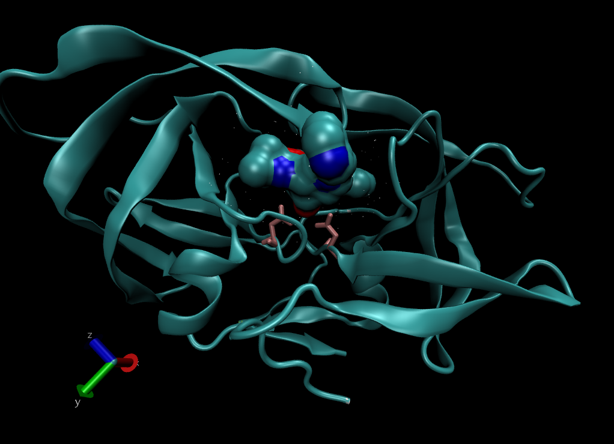

Class 11 Hands-on Worksheet
================

# The PDB Database

``` r
PDB_data <- read.csv(file = "PDB_data_downloaded.csv", row.names = 1)
PDB_data
```

    ##                          X.ray   NMR   EM Multiple.methods Neutron Other  Total
    ## Protein (only)          142419 11807 6038              177      70    32 160543
    ## Protein/Oligosaccharide   8426    31  991                5       0     0   9453
    ## Protein/NA                7498   274 2000                3       0     0   9775
    ## Nucleic acid (only)       2368  1378   60                8       2     1   3817
    ## Other                      149    31    3                0       0     0    183
    ## Oligosaccharide (only)      11     6    0                1       0     4     22

> Q1: What percentage of structures in the PDB are solved by X-Ray and
> Electron Microscopy?

``` r
# X-Ray
sum(PDB_data$X.ray)/sum(PDB_data$Total)
```

    ## [1] 0.8752836

``` r
# Electron Microscopy
sum(PDB_data$EM)/sum(PDB_data$Total)
```

    ## [1] 0.0494687

``` r
# X-Ray + EM
(sum(PDB_data$X.ray)+sum(PDB_data$EM))/sum(PDB_data$Total)
```

    ## [1] 0.9247523

How about for every method?

``` r
round(colSums(PDB_data) / sum(PDB_data$Total) * 100, 2)
```

    ##            X.ray              NMR               EM Multiple.methods 
    ##            87.53             7.36             4.95             0.11 
    ##          Neutron            Other            Total 
    ##             0.04             0.02           100.00

> Q2: What proportion of structures in the PDB are protein?

``` r
PDB_data[1,7] / sum(PDB_data$Total)
```

    ## [1] 0.873499

> Q3: Type HIV in the PDB website search box on the home page and
> determine how many HIV-1 protease structures are in the current PDB?

PDB search “HIV protease” -> 23409 Structures

> Q4: Water molecules normally have 3 atoms. Why do we see just one atom
> per water molecule in this structure?

The hydrogen molecules cannot be resolved with the level of anstroms for
this protein, so it can’t be seen !

> Q5: There is a conserved water molecule in the binding site. Can you
> identify this water molecule? What residue number does this water
> molecule have (see note below)?

MERC protein binding site



# Using Bio3D in R

``` r
library(bio3d)
pdb <- read.pdb("1hsg")
```

    ##   Note: Accessing on-line PDB file

``` r
pdb
```

    ## 
    ##  Call:  read.pdb(file = "1hsg")
    ## 
    ##    Total Models#: 1
    ##      Total Atoms#: 1686,  XYZs#: 5058  Chains#: 2  (values: A B)
    ## 
    ##      Protein Atoms#: 1514  (residues/Calpha atoms#: 198)
    ##      Nucleic acid Atoms#: 0  (residues/phosphate atoms#: 0)
    ## 
    ##      Non-protein/nucleic Atoms#: 172  (residues: 128)
    ##      Non-protein/nucleic resid values: [ HOH (127), MK1 (1) ]
    ## 
    ##    Protein sequence:
    ##       PQITLWQRPLVTIKIGGQLKEALLDTGADDTVLEEMSLPGRWKPKMIGGIGGFIKVRQYD
    ##       QILIEICGHKAIGTVLVGPTPVNIIGRNLLTQIGCTLNFPQITLWQRPLVTIKIGGQLKE
    ##       ALLDTGADDTVLEEMSLPGRWKPKMIGGIGGFIKVRQYDQILIEICGHKAIGTVLVGPTP
    ##       VNIIGRNLLTQIGCTLNF
    ## 
    ## + attr: atom, xyz, seqres, helix, sheet,
    ##         calpha, remark, call

> Q7: How many amino acid residues are there in this pdb object?

198 residues

> Q8: Name one of the two non-protein residues?

HOH

> Q9: How many protein chains are in this structure?

2 chains

Do a normal mode analysis, a prediction of the conformational
variability and intrinsic dynamics of this protein.

``` r
head(pdb$atom)
```

    ##   type eleno elety  alt resid chain resno insert      x      y     z o     b
    ## 1 ATOM     1     N <NA>   PRO     A     1   <NA> 29.361 39.686 5.862 1 38.10
    ## 2 ATOM     2    CA <NA>   PRO     A     1   <NA> 30.307 38.663 5.319 1 40.62
    ## 3 ATOM     3     C <NA>   PRO     A     1   <NA> 29.760 38.071 4.022 1 42.64
    ## 4 ATOM     4     O <NA>   PRO     A     1   <NA> 28.600 38.302 3.676 1 43.40
    ## 5 ATOM     5    CB <NA>   PRO     A     1   <NA> 30.508 37.541 6.342 1 37.87
    ## 6 ATOM     6    CG <NA>   PRO     A     1   <NA> 29.296 37.591 7.162 1 38.40
    ##   segid elesy charge
    ## 1  <NA>     N   <NA>
    ## 2  <NA>     C   <NA>
    ## 3  <NA>     C   <NA>
    ## 4  <NA>     O   <NA>
    ## 5  <NA>     C   <NA>
    ## 6  <NA>     C   <NA>

``` r
m <- nma(pdb)
```

    ## Warning in nma.pdb(pdb): Possible multi-chain structure or missing in-structure residue(s) present
    ##   Fluctuations at neighboring positions may be affected.

    ##  Building Hessian...     Done in 0.074 seconds.
    ##  Diagonalizing Hessian...    Done in 0.2 seconds.

``` r
plot(m)
```

<!-- -->

Make a little movie (trajectory) for viewing in VMD.

``` r
mktrj(m, file = "nma.pdb")
```
